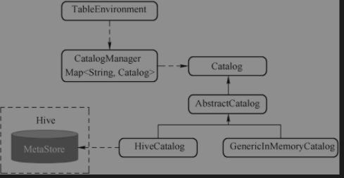
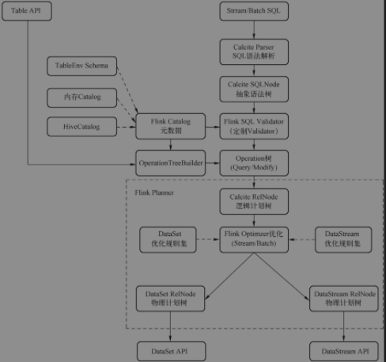
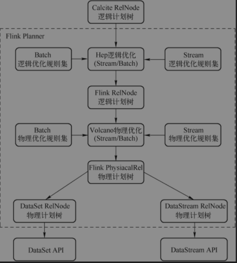

## Flink SQL

### 元数据(Catalog)

#### 元数据管理

> 元数据包含的类型有：库、表、视图、UDF、表字段定义

```text
Flink中实现了内存型GenericInMemoryCatalog、HiveCatalog和AbstractJdbcCatalog
1. 内存型GenericInMemoryCatalog：元数据在内存中临时保存，无持久化存储，在SQL校验和优化中使用
2. HiveCatalog: 利用Hive存储元数据
3. AbstractJdbcCatalog：包括JDBC、Mysql、Postgres
```



### Planner关键抽象

> PlannerBase包含StreamPlanner和BatchPlanner,核心逻辑在PlannerBase#translate

flink中Planner定义两个行为：

1. SQL解析：将SQL字符串解析为对Operation树
2. 关系代数转成Flink执行计划：将Operation树转换为Transformation

#### Expression

用来表示尚未进过解析的表达式，解析、验证之后成为ResolvedExpression，可以表达树形的表达式结构。可表达数学运算、条件运算、逻辑运算、函数调用

#### Operation

是SQL操作的抽象，包括DQL、DML、DDL、DCL。通过解析Sql语句后生成Operation。

#### 物理计划节点

* ExecNode：物理计划
* StreamExecNode：流处理物理计划

### Blink SQL执行过程



#### 从SQL到Operation

首先通过Planner提供SQL解析器将SQL语句从文本转换为Operation,总体过程如下：

1. 解析SQL字符串转换为Operation
2. SQL字符串解析为SqlNode
3. 校验SqlNode
4. 调用Calcite SQLToRelConverter将SqlNode转换为RelNode逻辑树
5. RelNode转换为Operation

#### 从Operation到Transformation

> Operation->RelNode->FlinkPhysicalRel->ExecNode->Transformation

1. 从Operation转换为Calcite RelNode使用Calcite优化器
2. 使用Flink定制Calcite优化器优化，对于流使用StreamPlanner进行优化

### SQL优化

常见的优化规则包含谓词下推、列裁剪、常量折叠等。

#### 基于规则的优化器(RBO)

根据事先设定好的优化规则对SQL计划树进行转换，降低计算成本。不考虑数据的规模、数据倾斜等问题。

执行过程

1. 规则转换：等价改变查询语句，决定了是否重写用户的查询(包括视图合并、谓词推进、非嵌套子查询/子查询反嵌套、物化视图重写)，生成更好的查询计划
2. 计划生成：将逻辑计划构建成物理执行计划，对应Flink中就是构建Transformation

#### 基于代价的优化器(CBO)

根据事先设定好的优化规则对SQL计划树反复应用规则，根据统计信息和代价模型计算每个执行计划的代价，从中挑选代价最小的执行计划。依赖统计信息和代价模型。一般情况下，CBO是优于RBO的，原因是RBO是一种只认规则，只针对数据不敏感的过时的优化器。在实际场景中，数据往往是有变化的，通过RBO生成的执行计划很有可能不是最优的。目前各大数据库和大数据计算引擎都倾向于使用CBO。

执行过程：

1. 规则转换
2. 代价评估：通过复杂的算法来统计信息，进而评估各个执行计划的总体成本，包括选择性(Selectivity)、基数(Cardinality)、成本(Cost)，同时考虑可能的访问路径(AccessPath)
   、关联方法和关联顺序，生成不同的执行计划，让查询优化器从这些计划中选择出执行代价最小的一个计划。
3. 计划生成: 生成大量的执行计划，然后选择其总体代价或总体成本最低的一个执行计划，转换为Flink的执行计划

CBO实现有两种模型，即Volcano模型和Cascades模型，其中Calcite使用的是Volcano模型，而Orca使用的是Cascades模型。这两种模型的思想基本相同，不同点在于Cascades模型一边遍历SQL逻辑树，一边优化，从而进一步裁剪掉一些执行计划。

### Flink优化

Sql优化不是单纯使用Calcite的HepPlanner或者VolcanoPlanner，而是在不同优化阶段使用不同的Calcite Planner

#### 优化器

通过规则组合和Calcite优化器的组合，分别为流和批实现了自定义的优化器，优化过程分阶段进行，不同阶段使用不同的优化器和规则集

1.CommonSubGraphBasedOptimizer: 基于DAG的公共子图优化将原始的RelNode DAG优化为语义等价RelNode DAG。被分解成多棵子树(每棵子树一个根，即只要一个Sink),每棵子树使用单独优化

优化算法的过程

1. 首先将RelNode DAG分解为多棵子树(RelNodeBlock),然后生成一个RelNodeBlock DAG。每个RelNodeBlock只要一个Sink,代表一颗子树
2. 递归优化RelNodeBlock，优化顺序从叶子节点(Source)到根节点(Sink)，包装为一个IntermediateRelTable
3. 优化完成之后将IntermediateRelTable重新展开生成优化后的RelNode DAG

#### 代价计算

Flink的优化器混合使用了Calcite的优化器，在使用基于代价优化的Volcano模型的时候，影响优化最重要的一点就是每个计划节点的代价计算。代价计算涉及了5种资源：数据量、CPU资源使用、内存资源使用、IO资源使用和网络资源使用。

#### 优化过程

优化分为两个阶段：逻辑优化阶段和物理优化阶段。优化过程并不是全部托管给Calcite的优化器，而是混合使用了Calcite的Hep规则优化器和Volcano代价优化器。逻辑优化使用Calcite的Hep优化器(基于规则)
，物理优化阶段使用了Calcite的Hep规则优化器和Volcano优化器(基于代价)。

CommonSubGraphBasedOptimizer中FlinkOptimizeProgram将具体的优化交给Calcite来执行。FlinkOptimizeProgram将不同的优化规则组合到优化器中。

1. FlinkChainedProgram: 优化程序链、容器类型，将一组FlinkOptimizeProgram顺序组织圈起来，当执行优化的时候，依照顺序依次执行。
2. FlinkGroupProgram：与1类似，不同之处该优化程序支持迭代执行多次
3. FlinkRuleSetProgram: 基于规则集的优化程序，其有两个实现类：FlinkHepRuleSetProgram和FlinkVolcanoProgram。FlinkHepRuleSetProgram基于Calcite的HepPlanner进行优化(RBO，基于规则)。FlinkVolcanoProgram基于Calcite的VolcanoPlanner进行优化(CBO，基于代价)。
4. FlinkDecorrelateProgram: 进行去相关优化规则的包装，对Flink SQL计划进行去相关优化。
5. FlinkHepProgram: FlinkHepRuleSetProgram底层依赖于FlinHepProgram。FinkHepProgram提供了更底层的接口和控制
6. FlinkVolcanoProgram: 包装优化规则，在底层依赖于Calcite Volcano优化器对Flink的SQL计划进行优化。
7. FlinkMiniBatchIntervalTraitInitProgram: 对于启用Mini-Batch模式的Flink SQL逻辑计划，在推断之前进行一些初始化。

#### 优化规则
在执行优化之前，FlinkStreamProgram首先将逻辑优化规则和物理优化全部加载进来，为规则集分配优化器

规则集。
1. SUBQUERY_REWRITE：子查询重写规则集，基于规则的优化器。
2. TEMPORAL_JOIN_REWRITE：历史记录表重写规则集，基于规则的优化器。
3. TIME_INDICATOR：时间属性规则集，基于规则的优化器。
4. DEFAULT_REWRITE：默认重写规则集，基于规则的优化器。
5. PREDICATE_PUSHDOWN：断言下推规则集，基于规则的优化器。
6. JOIN_REORDER：Join重排序规则集，基于规则的优化器。
7. LOGICAL：逻辑优化规则集，基于规则的优化器。
8. LOGICAL_REWRITE：逻辑规则集，基于规则的优化器。
9. PHYSICAL：物理优化规则集，基于规则的优化器。
10. PHYSICAL_REWRITE：物理重写规则，基于规则的优化器。序号即优化规则的执行顺序，其中1 ~ 8是逻辑优化规则，9 ~ 10是物理优化规则。
### 代码生成
优化器负责全局的优化，从提升全局资源利用率、消除数据倾斜、降低IO等角度进行优化，包括Join重写等。代码生成负责局部优化，优化具体Task的执行效率，主要依赖Codegen技术，具体包括Expression表达式级别和执行逻辑级别的代码生成。
