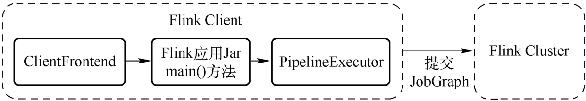
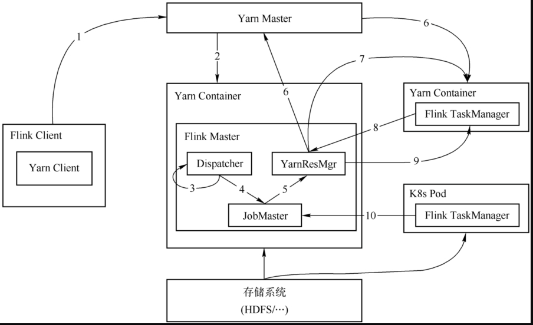
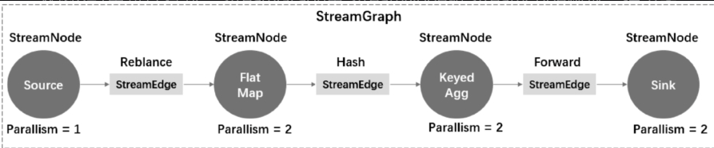

# Flink提交

    flink开完完毕，ClientFrontend是入口，触发用户开发的flink jar文件中的main()方法，然后交给PipelineExecutor#execue方法，最终会选择一个触发一个具体的PipelineExecutor执行。



## Yarn Per-Job提交流程



1. 使用flink run -m yarn-cluster提交per-job模式的作业
2. yarn 启动flink器群，该模式启动入口是YarnJobClusterEntryPoint
3. Dispatcher从文件系统获取JobGraph,为作业创建JobMaster,将作业交给JobMaster(负责作业调度、管理作业和Task的生命周期)，构建ExecutionGraph(JobGraph的并行化版本)
4. JobMaster向YarnResourceManager申请资源，开始调度ExecutionGraph执行，向YarnResourceManager申请资源，初次提交作业集群还没有TaskManager，此时资源不足，开始申请资源
5. YarnResourceManager收到JobMaster的资源请求，如果当前有空闲Slot则将Slot分配JobMaster,负责YarnResourceManager将向yarn master请求创建TaskManager
6. YarnResourceManager将资源请求加入等待请求队列，并通过心跳向YARNRM申请新的Container资源来启动TaskManager进程，Yarn分配新的Container给TaskManager
7. YarnResourceManager启动，从HDFS加载jar文件等所需的相关资源，在容器中启动TaskManager
8. TaskManager启动后向ResourceManager注册，并把自己的Slot资源情况汇报给ResourceManager
9. ResourceManager从等待队列中取出Slot请求，向TaskManager确认资源可用情况，并告知TaskManager将Slot分配给了哪个JobMaster
10. TaskManager向JobMaster提供Slot,JobMaster调度Task到TaskManager的Slot上执行

## 流图(StreamGraph)



### StreamGraph对象

1. StreamNode
   StreamNode是StreamGraph中的节点，从Transformatition转换而来，可以理解表示一个算子，可以有多个输入，也可以有多个输出
2. StreamEdge
   StreamEdge是StreamGraph中的节点，用来连接StreamNode，StreamEdge包含旁路输出、分区器、字段筛选输出

### StreamGraph生成过程

    在flink client中生成，flink应用main方法，用户编写业务逻辑组装成Transformation流水线，最终调用StreamExecutionEnvironment.execute()开始触发StreamGraph构建

```java
    public StreamGraph getStreamGraph(boolean clearTransformations){
        StreamGraph streamGraph=getStreamGraphGenerator(transformations).generate();
        if(clearTransformations){
        transformations.clear();
        }
        return streamGraph;
        }
```

## 作业图(JobGraph)

1. JobVertex
   算子融合优化后多个StreamNode融合成一个JobVertex，输入是JobEdge，输出IntermediateDataSet
2. JobEdge
   在JobGraph连接IntermediateDataSet和JobVertex边，是一个数据流转通道
3. IntermediateDataSet
   中间数据集，用来表示JobVertex的输出，即该JobVertex中包含算子产生的数据集

### JobGraph生成过程

    JobGraph生成入口是StreamGraph，流处理使用StreamingJobGraphGenerator

```java
    private JobGraph createJobGraph(){
        preValidate();
        jobGraph.setJobType(streamGraph.getJobType());
        jobGraph.enableApproximateLocalRecovery(
        streamGraph.getCheckpointConfig().isApproximateLocalRecoveryEnabled());
        // 为每个节点生成确定的hash id 作为唯一标识，在提交和执行过程中保持不变
        Map<Integer, byte[]>hashes=
        defaultStreamGraphHasher.traverseStreamGraphAndGenerateHashes(streamGraph);

        List<Map<Integer, byte[]>>legacyHashes=new ArrayList<>(legacyStreamGraphHashers.size());
        for(StreamGraphHasher hasher:legacyStreamGraphHashers){
        legacyHashes.add(hasher.traverseStreamGraphAndGenerateHashes(streamGraph));
        }
        // 对streamGraph进行转换，生成JobGraph图
        setChaining(hashes,legacyHashes);
        setPhysicalEdges();
        // 设置共享slotGroup
        setSlotSharingAndCoLocation();
        setManagedMemoryFraction(
        Collections.unmodifiableMap(jobVertices),
        Collections.unmodifiableMap(vertexConfigs),
        Collections.unmodifiableMap(chainedConfigs),
        id->streamGraph.getStreamNode(id).getManagedMemoryOperatorScopeUseCaseWeights(),
        id->streamGraph.getStreamNode(id).getManagedMemorySlotScopeUseCases());
        configureCheckpointing();
        jobGraph.setSavepointRestoreSettings(streamGraph.getSavepointRestoreSettings());
final Map<String, DistributedCache.DistributedCacheEntry>distributedCacheEntries=
        JobGraphUtils.prepareUserArtifactEntries(
        streamGraph.getUserArtifacts().stream()
        .collect(Collectors.toMap(e->e.f0,e->e.f1)),
        jobGraph.getJobID());
        for(Map.Entry<String, DistributedCache.DistributedCacheEntry>entry:
        distributedCacheEntries.entrySet()){
        jobGraph.addUserArtifact(entry.getKey(),entry.getValue());
        }
        // 设置执行环境配置
        try{
        jobGraph.setExecutionConfig(streamGraph.getExecutionConfig());
        }catch(IOException e){
        throw new IllegalConfigurationException(
        "Could not serialize the ExecutionConfig."
        +"This indicates that non-serializable types (like custom serializers) were registered");
        }
        addVertexIndexPrefixInVertexName();
        setVertexDescription();
        return jobGraph;
        }
```

构建JobGraph的点和边

```java

private void setChaining(Map<Integer, byte[]>hashes,List<Map<Integer, byte[]>>legacyHashes){
final Map<Integer, OperatorChainInfo> chainEntryPoints=
        buildChainedInputsAndGetHeadInputs(hashes,legacyHashes);
final Collection<OperatorChainInfo> initialEntryPoints=
        chainEntryPoints.entrySet().stream()
        .sorted(Comparator.comparing(Map.Entry::getKey))
        .map(Map.Entry::getValue)
        .collect(Collectors.toList());

        // iterate over a copy of the values, because this map gets concurrently modified
        for(OperatorChainInfo info:initialEntryPoints){
        createChain(
        info.getStartNodeId(),
        1, // operators start at position 1 because 0 is for chained source inputs
        info,
        chainEntryPoints);
        }
        }
```

执行具体的Chain和JobVertex生成、JobEdge的关联、IntermediateDataSet。从StreamGraph读取数据的StreamNode开始，递归遍历同时将StreamOperator连接在一起。
整个构建的逻辑如下。

* 从Source开始，Source与下游的FlatMap不可连接，Source是起始节点，自己成为一个JobVertex。
* 此时开始一个新的连接分析，FlatMap是起始节点，与下游的KeyedAgg也不可以连接，那么FlatMap自己成为一个JobVertext。
* 此时开始一个新的连接分析，KeyedAgg是起始节点，并且与下游的Sink可以连接，那么递归地分析Sink节点，构造Sink与其下游是否可以连接，因为Sink没有下游，所以KeyedAgg和Sink节点连接在一起，共同构成了一个JobVertex。在这个JobVertex中，KeyedAgg是起始节点，index编号为0，Sink节点index编号为1。
   


## 执行图


