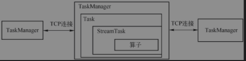
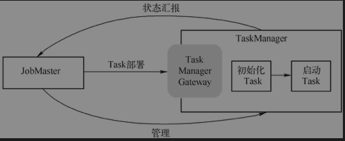

## 作业调度
作业提交给JobManager生成ExecutionGraph之后，作业调度中调度器根据调度模式选择对应调度策略，申请所需要的资源，将作业发布到TaskManager上。
### 调度
调度器是Flink作业执行的核心组件，管理作业执行所有相关过程包括JobGraph到ExecutionGraph转换，作业生命周期管理(作业的发布、取消、停止)、作业的Task生命周期管理(Task的发布、取消、停止)、资源申请与释放、作业和Task的Failover
* 调度器(SchedulerNG)
* 调度策略(SchedulingStrategy)
* 调度模式(SchedulerMode)：包括流和批调度

#### 调度器
两个调度器：1. DefaultScheduler  2. AdaptiveScheduler
```text
作用
1. 作业生命周期管理，如作业开始调度、挂起、取消
2. 作业执行资源的申请、分配、释放
3. 作业状态管理，作业发布过程中状态变化和作业异常时的FailOver等
4. 对外提供作业详细信息
```
```text
调度策略(SchedulingStrategy),包括VertexwiseSchedulingStrategy和PipelinedRegionSchedulingStrategy,其中包含4种行为
1. startScheduling: 调度入口，触发调度器的调度行为
2. restartTasks: 重启执行失败的Task, 一般是Task执行异常导致
3. onExecutionStateChange: 当Execution状态发生改变
4. onPartitionConsumable: IntermediateResultPartition中数据可以消费时
```
### 作业生命周期
#### 作业生命周期状态
JobMaster负责作业的生命周期管理，具体的管理行为在调度器和ExecutionGraph中实现


作业状态JobStatus,中9种状态
* Created: 作业刚创建，Task还没有开始执行
* Running: 任务创建后开始申请资源，并且TaskManager调度Task执行成功，进入Running
* Restarting: 任务执行错误，重启作业，先进去Failing，如可以重启则进入Restarting，作业重置，释放所有申请的资源(内存、slot等)
* Cancelling: 所有资源清理完毕，作业完全停止执行，进入Canceled，一般是用户主动停止
* Suspended: 在HA下JobManager宕机、备JobManager接管继续执行时，恢复ExecutionGraph
* Finished: 所有Task都成功执行完毕后，进入Finished
* Failing: 作业执行失败，作业代码抛出异常或者资源不够
* Failed: 异常状态达到作业自动重启次数的限制

#### Task生命周期
TaskManager负责Task的生命周期管理，并将状态变化通知到JobMaster,在ExecutionGraph中跟踪Execution的状态变化，一个Execution对应一个Task.
c

Task有8种生命周期状态
* Created: ExecutionGraph创建出来之后，Execution默认状态
* Scheduled: 在ExecutionGraph中有Scheduled，在TaskManager上Task不会有该状态，被调度执行的Task进入Scheduled
* Deploying: 资源申请完毕，向TaskManager部署Task
* Running: TaskManager启动Task,并通知JobManager该Task进入Running,JobManager将该Task所在的ExecutionGraph对应Execution设置为Running
* Finished: Task执行完毕，无异常进入Finished，JM将Task所在ExecutionGraph中的Execution设置为Finished
* Cancelling: 是ExecutionGraph中维护的一种状态，表示取消Task执行，等待TaskManager取消Task,并返回结果
* Canceled: TaskManager取消Task执行成功，并通知JobManager，JobManager将该Task所在的ExecutionGraph中对应的Execution设置为Canceled状态。
* Failed: TaskManger执行Task时出现异常导致Task无法继续执行，Task会进入Failed状态，并通知JobManager，JobManager将该Task所在的ExecutionGraph中对应的Execution设置为Failed状态。整个作业也将会进入Failed状态。

### 关键组件
#### JobMaster
JobMaster负责单个作业管理，允许通过外部命令干预作业运行(提交、取消)，维护整个作业Task状态，对外提供作业状态查询。接收JobGraph并将转换为ExecutionGraph，启动调度器执行ExecutionGraph
```text
作用
1. 将JobGraph转化为ExecutionGraph，调度Task的执行，并处理Task的异常，进行作业恢复或者中止。根据TaskManager汇报的状态维护ExecutionGraph。
2. Slot资源申请、持有和释放，具体管理动作是SlotPool执行，资源不足时负责与ResourceManager交互申请资源
3. CheckpointCoordinator负责进行检查点的发起、完成确认
4. 反压跟踪、作业状态、各算子吞吐量等监控指标
5. JobMaster、ResourceManager、TaskManager之前通过网络进行通信，两两心跳相互感知对方
```
#### TaskManager
> 负责执行计算任务的角色，实现类为TaskExecutor。是Task载体，负责启动、执行、取消。也是计算资源的载体，通过Slot切分其CPU、内存等计算资源
> 
> 为了实现Exactly-Once和容错，从整个集群的视角来看，JobManager是检查点的协调管理者，TaskManager是检查点的执行者。
> 
> TaskManager提供的数据交换基础框架，最重要的是跨网络的数据交换、内存资源的申请和分配以及其他需要在计算过程中Task共享的组件，如ShuffleEnvironment等。

#### Task
为StreamTask执行业务逻辑的时候提供组件，如内存管理器、IO管理器、输入网关、文件缓存


```text
Task内所需要组件
1. TaskStateManager: 负责State整体协调，封装了CheckpointResponder,在StreamTask中跟JobMaster交互，汇报检查点zhuangt
2. MemoryManager: Task通过该组件申请和释放内存
3. LibraryCacheManager: Task启动时，此组件远程下载所需要jar文件，在Task类加载器中加载
4. InputSplitProvider: 数据源算子用来向JobMaster请求分配数据集的分片，然后读取该分片数据
5. ResultPartitionConsumableNotifier: 结果分区可消费通知器，用于通知消费者生产者生产的结果分区可消费
6. PartitionProducerStateChecker: 分区状态检查器，用于检查生产端分区状态
7. TaskLocalStateStore: 在TaskManager本地提供State存储，恢复作业优先从本地恢复
8. IOManager: 批处理(排序、Join)内存无法存下会溢出到磁盘，并需要时读取回来
9. ShufflerEnvironment: 数据交换，包含数据写出、数据分区的管理
10. BroadcastVariableManager: Task可以共享该管理器，通过引用计数跟踪广播变量使用，没有使用时候则清除
11. TaskEventDispatcher: 任务事件分发器，从消费者任务分发时间给生产者任务
```
#### StreamTask

```text
生命周期3个阶段
1. 初始化
  1).StateBackend初始化，是实现有状态计算和Exactly-once关键组件
  2).时间服务初始化
  3).构建OperatorChain，实例化各个算子
  4).Task初始化，对于Task类型不同，初始化不同，然后再初始化StreamInputProcessor，将输入组件、算子处理数据、输出组件关联起来，形成完整通道
       对于SourceStreamTask，主要启动SourceFunction开始读取数据，若支持检查点，则开始检查点
       对于OneInputStreamTask,构建InputGate，包装到输入组件StreamTaskNetworkInput中从上游读取数据，构建Task输出组件StreamTaskNetworkOutput
  5).对OperatorChain中所有算子恢复状态，快照恢复，就把算子恢复到上一次保存快照状态
  6).算子恢复后，开启算子，将UDF函数加载、初始化进入执行状态
2. 运行，StreamInputProcessor持续读取数据，交给算子执行业务逻辑
3. 关闭与清理
  1).管理OperatorChain中所有算子，不再接收新的Timer定时器，处理完剩余数据，将算子的数据强制清理
  2).销毁算子，关闭StateBackend和UDF
  3).通用清理，停止相关的执行线程
  4).Task清理。关闭StreamInputProcessor，本质关闭StreamTaskInput，清理InputGate、释放序列化器
```
### 作业启动
#### JobMaster启动作业

#### TaskManager启动Task

#### Task启动
```text
1. Task部署
  1).JobMaster将Task的部署信息封装为TaskDeploymentDescriptor对象，通过SubmitTask消息发送个TaskExecutor。
  2).一个ExecutionGraph中每一个Execution对应一个Task，ExecutionEdge表示Task直接的数据交换关系。读取上游数据只用InputGate，结果写出使用ResultPartitionWriter
  3).ResultPartitionWriter和InputGate创建、销毁等管理由ShuffleEnvironment负责。ShuffleEnvironment底层数据存储对应的是Buffer,一个TaskManager只有一个ShuffleEnvironment,所有Task共享
2. 启动Task
  1).Task是容器，StreamTask才是用户逻辑执行奇点。在Task通过反射机制实例化StreamTask子类，触发StreamTask#invoke
```
### 作业失败调度
默认失败调度集成在默认调度器DefaultScheduler，具体的调度行为代理给ExecutionGraph
```text
恢复策略(FailoverStrategy)
1. RestartAllFailoverStrategy: 若Task发生异常则重启所有Task,恢复成本高，但恢复作业一致性最安全策略
2. RestartPipelinedRegionFailoverStrategy：分区恢复策略，若Task发生异常则重启该分区所有Task
```