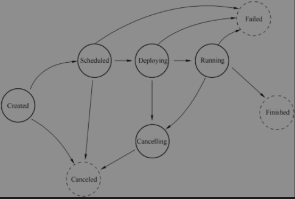

## 作业调度
作业提交给JobManager生成ExecutionGraph之后，作业调度中调度器根据调度模式选择对应调度策略，申请所需要的资源，将作业发布到TaskManager上。
### 调度
调度器是Flink作业执行的核心组件，管理作业执行所有相关过程包括JobGraph到ExecutionGraph转换，作业生命周期管理(作业的发布、取消、停止)、作业的Task生命周期管理(Task的发布、取消、停止)、资源申请与释放、作业和Task的Failover
* 调度器(SchedulerNG)
* 调度策略(SchedulingStrategy)
* 调度模式(SchedulerMode)：包括流和批调度

#### 调度器
两个调度器：1. DefaultScheduler  2. AdaptiveScheduler
```text
作用
1. 作业生命周期管理，如作业开始调度、挂起、取消
2. 作业执行资源的申请、分配、释放
3. 作业状态管理，作业发布过程中状态变化和作业异常时的FailOver等
4. 对外提供作业详细信息
```
```text
调度策略(SchedulingStrategy),包括VertexwiseSchedulingStrategy和PipelinedRegionSchedulingStrategy,其中包含4种行为
1. startScheduling: 调度入口，触发调度器的调度行为
2. restartTasks: 重启执行失败的Task, 一般是Task执行异常导致
3. onExecutionStateChange: 当Execution状态发生改变
4. onPartitionConsumable: IntermediateResultPartition中数据可以消费时
```
### 作业生命周期
#### 作业生命周期状态
JobMaster负责作业的生命周期管理，具体的管理行为在调度器和ExecutionGraph中实现


作业状态JobStatus,中9种状态
* Created: 作业刚创建，Task还没有开始执行
* Running: 任务创建后开始申请资源，并且TaskManager调度Task执行成功，进入Running
* Restarting: 任务执行错误，重启作业，先进去Failing，如可以重启则进入Restarting，作业重置，释放所有申请的资源(内存、slot等)
* Cancelling: 所有资源清理完毕，作业完全停止执行，进入Canceled，一般是用户主动停止
* Suspended: 在HA下JobManager宕机、备JobManager接管继续执行时，恢复ExecutionGraph
* Finished: 所有Task都成功执行完毕后，进入Finished
* Failing: 作业执行失败，作业代码抛出异常或者资源不够
* Failed: 异常状态达到作业自动重启次数的限制

#### Task生命周期
TaskManager负责Task的生命周期管理，并将状态变化通知到JobMaster,在ExecutionGraph中跟踪Execution的状态变化，一个Execution对应一个Task.


Task有8种生命周期状态
* Created: ExecutionGraph创建出来之后，Execution默认状态
* Scheduled: 在ExecutionGraph中有Scheduled，在TaskManager上Task不会有该状态，被调度执行的Task进入Scheduled
* Deploying: 资源申请完毕，向TaskManager部署Task
* Running: TaskManager启动Task,并通知JobManager该Task进入Running,JobManager将该Task所在的ExecutionGraph对应Execution设置为Running
* Finished: Task执行完毕，无异常进入Finished，JM将Task所在ExecutionGraph中的Execution设置为Finished
* Cancelling: 是ExecutionGraph中维护的一种状态，表示取消Task执行，等待TaskManager取消Task,并返回结果
* Canceled: TaskManager取消Task执行成功，并通知JobManager，JobManager将该Task所在的ExecutionGraph中对应的Execution设置为Canceled状态。
* Failed: TaskManger执行Task时出现异常导致Task无法继续执行，Task会进入Failed状态，并通知JobManager，JobManager将该Task所在的ExecutionGraph中对应的Execution设置为Failed状态。整个作业也将会进入Failed状态。

### 关键组件
#### JobMaster
#### TaskManager
#### Task
#### StreamTask
### 作业启动
### 作业停止
### 作业失败调度
### 组件容错