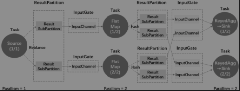
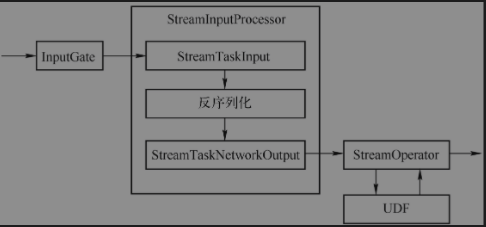
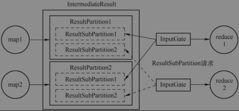

## 作业执行
### 作业执行图

### 核心对象
#### 输入处理器(StreamInputProcessor)
是对StreamTask中读取数据行为抽象，完成数据的读取、处理、输出给下游。


以StreamOneInputProcessor为例，核心方法是StreamOneInputProcessor#processInput,调用StreamTaskInput(AbstractStreamTaskNetworkInput)#emitNext触发数据的读取，将数据反序列化为StreamRecord,交给StreamTaskNetworkOutput触发StreamOperator算子处理，最终触发UDF的processElement
#### Task输入(StreamTaskInput)
```text
有两种数据读取行为
1. StreamTaskNetworkInput: 负责从上游Task获取数据，底层使用InputGate读取数据
2. StreamTaskSourceInput: 负责从外部数据源获取数据，本质使用SourceFunction
```
#### Task输出(StreamTaskNetworkOutput)
只负责将数据交给算子来进行处理，实际的数据写出是算子层执行
#### 结果分区(ResultPartition)
表示作业的单个Task产生的数据。ResultPartition是运行时实体，与ExecutionGraph中的中间结果分区对应(IntermediateResultPartition),一个ResultPartition是一组Buffer实例，ResultPartition由ResultSubPartition组成。ResultSubPartition是用来进一步将ResultPartition进行切分，切分多少个是取决于直接下游任务并行度和数据分发模式
#### 结果子分区(ResultSubPartition)
结果分区的一部分，负责存储实际的Buffer
```text
有两种结果子分区
1. PipelinedSubPartition(流处理)：纯内存型的结果子分区，只能被消费一次，添加一个完成的BufferConsumer或者添加下一个BufferConsumer(默认前一个是完成的)，会通知PipelinedSubPartitionView新数据到达，可消费
2. BoundedBlockingSubPartition(批处理)：阻塞式，需等待上游所有的数据处理完毕，然后下游才可以开始消费
```
#### 输入网关(InputGate)
是Task输入数据的封装，和JobGraph中的JobEdge一一对应，对应上游的ResultPartition。InputGate负责实际数据消费的是InputChannel,是InputChannel的容器，用于读取中间结果(IntermediateResult)在并行时由上游Task产生的一个或多个结果分区

#### 输入通道(InputChannel)
包含一个以上的InputChannel，和ExecutionEdge一一对应，也和结果子分区一对一相连，即一个InputChannel接收一个结果子分区的输出。
```
1. LocalInputChannel:对应本地结果子分区的输入通道，用来在本地进程内不同线程之间交换数据
2. RemoteInputChannel:对应于远程的结果子分区的输入通道，用来表示跨网络的数据交换，底层基于Netty。
3. UnknownInputChannel:一种用于占位目的的输入通道，需要占位通道是因为暂未确定相对于Task生产者的位置，在确定上游Task位置之后，如果位于不同的TaskManager则替换为RemoteInputChannel，如果位于相同的TaskManager则转换为LocalInputChannel。
4. RecoveredInputChannel:输入通道从以前未对齐的检查点快照中读取恢复状态
```

### Task执行
基于Mailbox单线程的执行模型，取代现有多线程模型。线程的执行模型，取代现有的多线程模型。所有的并发操作都通过队列进行排队（Mailbox），单线程 （Mailbox线程）依次处理，这样就避免了并发操作。
#### Task处理数据
当算子处理完毕，数据传给下一个算子进行计算，有三种数据传递情形
* OperatorChain内部数据传递，发生在本地线程内
* 同一个TaskManager的不同Task之间传递数据，发生在同一个JVM德不同线程之间
* 不同TaskManager的Task之间数据传递是跨JVM的，需要使用跨网络的通信。