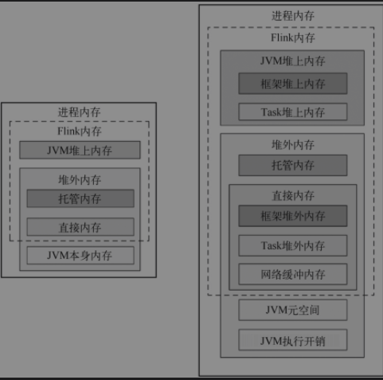

## 内存管理
Flink自主进行内存管理，将数据以二进制结构保存在内存，使用大量堆外内存。允许使用JDK提供类型和自定义类型开发Function,类型与序列化系统目的就是解决Java对象类型与内部二进制结构不一致问题。
> Flink目前有两套逻辑类型系统，1.TypeInformation类型 2.Flink SQL中的LogicalType类型系统
### 自主内存管理
Java对象信息被序列化为二进制数据流，在内存中连续存储，保存在预分配的内存块上，内存块叫MemorySegment,是内存分配的最小单元，是一段固定长度的内存(默认大小32kb)
### 内存模型


#### Flink内存
```text
1. JVM堆上内存
   1).Flink框架堆上内存(Framework Heap Memory)本身所使用的内存，即TaskManager本身所占用的堆上内存，配置参数：taskmanager.memory.framework.heap.size=128MB，默认128MB。
   2).Task执行用户代码所使用的内存，配置参数：taskmanager.memory.task.heap.size
2. JVM堆外内存
   1).Flink框架堆外内存(Framework Off-Heap Memory)本身所使用的内存，配置参数：taskmanager.memory.framework.off-heap.size=128MB，默认128MB。
   2).Task堆外内存Task Off-Heap Memory。Task执行用户代码时所使用的堆外内存，配置参数：taskmanager.memory.task.off-heap.size = 0，默认为0。
   3).网络缓冲内存Network Memory。网络数据交换所使用的堆外内存大小，如网络数据交换缓冲区（Network Buffer),配置参数:taskmanager.memory.network.［64/1024/0.1］）（min/max/fraction），默认min=64MB, max=1gb, fraction=0.1。
   4).堆外托管内存Managed Memory。Flink管理的堆外内存。配置参数：taskmanager.memory.managed.［size|fraction］），默认fraction=0.4。
```
#### JVM本身内存
```text
1. JVM元空间，配置参数：taskmanager.memory.jvm-metaspace =96m，默认96MB。
2. JVM执行开销，JVM在执行时自身所需要的内容，包括线程堆栈、IO、编译缓存等所使用的内存。配置参数：taskmanager.memory.jvm-overhead= ［min/max/fraction］）。默认min=192MB,max=1GB, fraction=0.1。
```

### 内存数据结构
#### 内存段(MemorySegment)
Flink的内存抽象的最小分配单元，默认32KB大小的内存块，既可以是堆上内存(Java的byte数组)，也可以是堆外内存(基于netty的DirectByteBuffer)。MemorySegment提供对二进制进行读取和写入。
```text
MemorySegment结构
1. BYTE_ARRAY_BASE_OFFSET：二进制字节数组的起始索引，相对于字节数组对象
2. LITTLE_ENDIAN: 判断是否wieldLittle Endian模式字节存储顺序，如不是，则是Big Endian模式
3. HeapMemory: 使用堆上内存，则表示一个堆上的字节数组，若使用堆外内存，则内null
4. address：字节数组对应的相对地址
5. addressLimit: 标识地址结束位置
6. size：内存段的字节数
```
### 内存管理器(MemoryManager)
Flink中管理托管内存组件，只使用堆外内存，流计算中作为RocksDBStateBackend的内存，通过内部接口MemoryPool来管理所有MemorySegment
### 网络缓冲器(NetworkBuffer)
是网络交换数据的包装，当结果分区(ResultPartition)开始写数据时候，需向LocalBufferPool申请Buffer资源，使用BufferBuilder将数据写入MemorySegment。当MemorySegment都分配完后，则会持续等待Buffer释放


BufferBuilder在上游Task中，用来向申请到的MemorySegment写入数据。与BufferBuilder相对的是BufferConsumer，BufferConsumer位于下游Task中，负责从MemorySegment中读取数据。1个BufferBuilder对应1个BufferConsumer。
