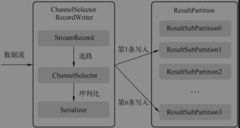
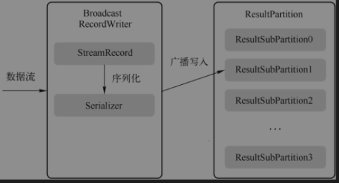
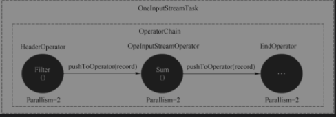
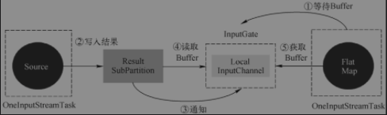
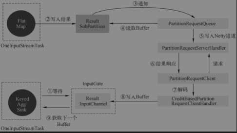
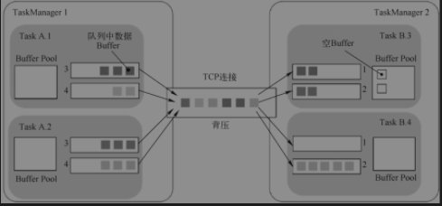
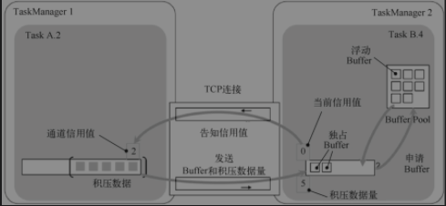

## 数据交换
### 关键组件
#### RecordWriter
负责将Task处理的数据输出,面相的是StreamRecord,直接处理算子的输出结果，ResultPartitionWriter面向Buffer,承上启下。RecordWriter负责将StreamRecord进行序列化

Flink RecordWriter两种写入方式：单播和广播
##### 单播
ChannelSelector对数据流中的每一条数据记录进行选路，有选择地写入一个输出通道的ResultSubPartition中，适用于非BroadcastPartition。如果在开发的时候没有使用Partition，默认会使用RoundRobinChannelSelector，使用RoundRobin算法选择输出通道循环写入本地输出通道对应的ResultPartition，发送到下游Task


##### 广播
广播就是向下游所有的Task发送相同的数据，在所有的ResultSubPartition中写入N份相同数据。


##### 数据记录序列化器(RecordSerializer)
##### 数据记录反序列化器(RecordDeserializer)
##### 结果子分区视图(ResultSubPartitionView)
定义ResultSubPartition中读取数据、释放资源等，通过getNextBuffer获取Buffer
* PipelinedSubPartitionView: 用来读取PipelinedSubPartition中数据
* BoundedBlockingSubpartitionDirectTransferReader: 用来读取BoundedBlockingSubPartition中数据
##### 数据输出(Output)
是算子向下游传递数据抽象,定义了向下游发送StreamRecord、Watermark、LatencyMark的行为，对于StreamRecord，多了一个SideOutput的行为定义。
### 数据传递
数据处理的业务逻辑位于UDF的processElement方法中，算子调用UDF处理数据完毕之后将数据交给下一个算子。Flink的算子使用Collector接口进行数据传递。
#### 本地线程内的数据传递
本质是属于同一个OperatorChain的算子之间的数据传递，在执行时会被调度到同一个Task。上游的算子处理数据，然后通过Collector接口直接调用下游算子的processElement方法，在同一个线程内执行普通的Java方法，没有将数据序列化写入共享内存、下游读取数据再反序列化的过程，线程切换的开销也省掉了。



#### 本地线程间的数据传递
同一个TaskManager的不同Task的算子之间，不会通过算子间的直接调用方法传输数据，而是通过本地内存进行数据传递。


#### 跨网络的数据传递
运行在不同TaskManagerJVM中的Task之间的数据传递，与本地线程间的数据交换类似，当没有Buffer可以消费时，会通过PartitionartitionRequestClient向FlatMap Task所在的进程发起RPC请求，远程的PartitionRequestServerHandler接收到请求后，读取ResultPartition管理的Buffer，并返回给Client。


1. Keyed/Agg所在线程从InputGate的RemoteChannel中消费数据，如果没有数据则阻塞在RemoteInputChannel中的receivedBuffers上，等待数据。
2. FlatMap持续处理数据，并将数据写入ResultSubPartition中。
3. ResultSubPartition通知PartitionRequestQueue有新的数据。
4. PartitionRequestQueue从ResultSub读取数据。
5. ResultSubPartition将数据通过PartitionRequestServerHandler写入NettyChannel，准备写入下游Netty。
6. Netty将数据封装到Response消息中，推送给下游。此处需要下游对上游的request请求，用来建立数据从上游到下游的通道，此请求是对ResultSubPartition的数据请求，创建了PartitionRequestQueue。
7. 下游Netty收到Response消息，进行解码。
8. CreditBasedPartitionRequestClientHandler将解码后的数据写入RemoteInputChannel的Buffer缓冲队列中，然后唤醒Keyed/Agg所在线程消费数据。
9. 从Keyed/Agg所在线程RemoteInputChannel中读取Buffer缓冲队列中的数据，然后进行数据的反序列化，交给算子中的用户代码进行业务处理。
### 数据传递过程
1. 算子处理完交给RecordWriter,每条记录都要选择下游节点，需通过ChannelSelector找到对应结果子分区
2. 每个结果子分区都有一个独有序列化器，将该条数据记录序列化为二进制数据
3. 写入结果分区下的各个子分区中，该数据存入MemorySegment
4. 单独线程控制数据flush速度，则通过Netty的nio通道向对端写入
5. 对端Netty Client接收数据，解码出来将数据复制到Buffer,然后通知InputChannel
6. 有可用数据时，下游算子从阻塞醒来，从InputChannel取出Buffer,再反序列化为数据记录，交给算子执行用户代码(UDF)
#### 数据读取(ResultSubPartitionView)
```text
有两类对象会接收该通知
1. LocalInputChannel：本地JVM线程之间的数据传递
2. CreditBasedSequenceNumberingViewReader：用来对本机跨JVM或者跨网络的数据传递
```
StreamTask#processInput -> StreamOneInputStreamProcessor#processInput -> AbstractStreamTaskNetworkInput#emitNext -> SpillingAdaptiveSpanningRecordDeserializer
#### 数据写出
Task算子执行UDF之后，需要将数据交给下游处理。RecordWriter负责将StreamRecord进行序列化，再写入MemorySegment(每个Task都有自己的LocalBufferPool,LocalBufferPool包含多个MemorySegment),数据序列化之后，通过Channel编号选择结果子分区，将数据复制到结果子分区中，在写入过程中，序列化器将数据复制到BufferBuilder中，如果数据太大，则需要写入多个Buffer，即跨内存段写入数据
### 网络通信
Flink Task在物理层面是基于TCP连接，且TaskManager上的所有Task共享一个TCP连接。
#### 无流控

```text
1. 当Task的发送缓冲池耗尽时，也就是结果子分区的Buffer队列中或更底层的基于Netty的网络栈的网络缓冲区满时，生产者Task就被阻塞，无法继续处理数据，开始产生背压。
2. 当Task的接收缓冲区耗尽时，也是类似的效果，较底层网络栈中传入的Netty Buffer需要通过网络缓冲区提供给Flink。
3. 如果相应Task的缓冲池中没有可用的Buffer，Flink停止从该InputChannel读取，直到在缓冲区中有可用Buffer时才会开始读取数据并交给算子进行处理。这将对使用该TCP连接的所有Task造成背压，影响范围是整个TaskManager上运行的Task。
```
#### 基于信用流控
通过信用流控机制可以确保下游总是有足够的内存接收上游的数据，不会出现下游无法接收上游数据的情况。



该流控机制作用于Flink的数据传递层，在结果子分区(ResultSubPartition)和输入通道(InputChannel)引入了信用机制，每个远端的InputChannel现在都有自己的一组独占缓冲区，不再使用共享的本地缓冲池。LocalBufferPool中的Buffer(缓存)称为浮动缓存(Float Buffer)，因为LocalBufferPool的大小是浮动的，并可用于所有InputChannel。

下游接收端将当前可用的Buffer数量作为信用值(1 Buffer = 1信用)通知给上游。每个结果子分区(ResultSubPartition)将跟踪其对应的InputChannel的信用值。如果信用可用，则缓存仅转发到较底层的网络栈，每发送一个Buffer都会对InputChannel的信用值减1。在发送Buffer的同时，还会发送前结果子分区(ResultSubPartition)队列中的积压数据量(Backlog Size)。下游的接收端会根据积压数据量从浮动缓冲区申请适当数量的Buffer，以便更快地处理上游积压等待发送的数据。下游接收端首先会尝试获取与Backlog大小一样多的Buffer，但浮动缓冲区的可用Buffer数量可能不够，只能获取一部分甚至获取不到Buffer。下游接收端会充分利用获取到的Buffer，并且会持续等待新的可用Buffer。
