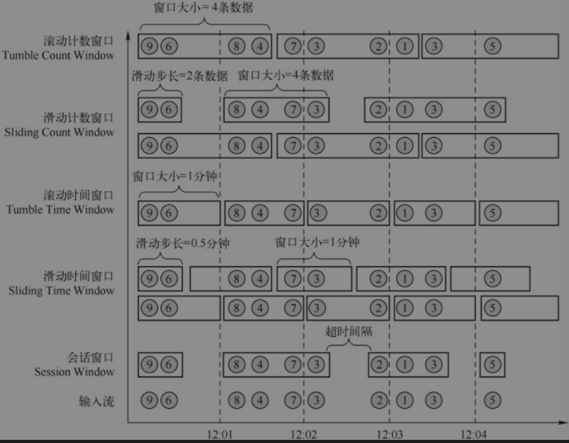
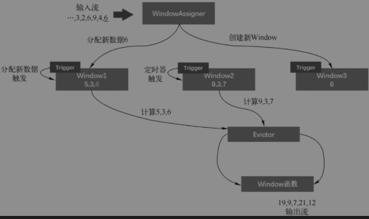
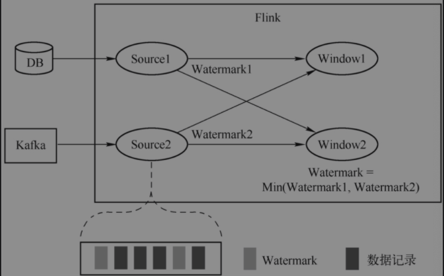
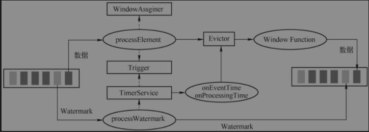

## 时间与窗口
> 时间类型：包含事件时间(Event Time)、处理时间(Processing Time)、摄取时间(Ingestion Time)
### 窗口类型

### 窗口原理与机制
WindowOperator负责处理窗口，每一个数据元素进入算子，先会交给WindowAssigner决定元素被放到哪些窗口，这个过程中会创建新窗口或者合并旧窗口。

```text
1. Window只是一个ID标识符，内部可能存储一些元数据，如TimeWindow中有开始和结束时间，窗口内并不会存储窗口中元素。元素实际存在Key(窗口)/Value State(数据集合或聚合值),
2. 每个Window都有一个自己Trigger,Trigger上有定时器，用来决定一个窗口何时被计算或者清楚
3. Trigger Fire触发后，窗口中的元素集合会交给Evictor,主要用来遍历元素列表，并决定最先进入窗口多少个元素被移除，其他元素交给指定用户指定函数进行窗口计算。若没有Evictor，窗口中所有元素一起交给函数进行计算
4. 计算函数收到窗口元素，计算出窗口结果，并发送给下游，结果可以是一个或多个。如sum()、min()以及ReduceFunction和WindowFunction
5. 聚合类计算(sum和min)优化，不需要把窗口所有数据都保存下来，只需保存一个中间结果值。当定义了Evictor则不启用窗口优化，内需遍历窗口所有元素，所有元素都存下来
```
#### WindowAssigner
用来决定某个元素被分配到哪个窗口中去，DataStream 与 Table 有两套WindowAssigner体系

#### WindowTrigger
用来决定一个窗口何时能够被计算或清除
```text
Trigger触发结果
1. Continue: 继续，不做任何操作
2. Fire: 触发计算，处理窗口数据并保留窗口原样，窗口中的数据不清理
3. Purge: 触发清理，移除窗口和窗口中的数据
4. Fire + Purge: 处理数据并移除窗口和窗口中的数据
```
```text
Table Trigger分为两类：触发逻辑的判断和合并
三种延迟计算
1. 基于数据元素个数的触发(CountTrigger)，即Window中数据达到一定个数，则触发窗口的计算
2. 基于处理时间的触发(ProcessingTimeTrigger)，处理时间维度判断哪些窗口需要触发
3. 基于事件时间的触发，使用Watermark机制触发
```
#### WindowEvictor
窗口数据的过滤器，内置三种窗口过滤器：
1. CountEvictor(计数过滤器)，Window中保留指定数量的元素，并从窗口头部开始丢弃其余元素
2. DelttaEvictor(计数过滤器)，自定义规则，与事先定义好的阈值进行比较，丢弃超过阈值的数据记录
3. TimeEvictor(时间过滤器)，保留Window中最近一段时间内的元素，并丢弃其余元素
#### Window函数
1. 增量计算函数，保存一份中间数据，每进一个新元素，新元素与中间数据两两合一，生成新的中间数据，再保存到窗口中，如ReduceFunction、AggregateFunction
2. 全量计算函数,先缓存窗口所有元素，等触发条件后所有元素执行计算，如ProcessWindowFunction
### 水印(Watermark)
#### DataStream Watermark
1. Source Function可直接为数据元素分配时间戳，同时向下游发送Watermark
2. DataStream使用TimestampAssigner定义时间戳的提取，AssignerWithPeriodicWatermarks是周期性生成Watermark策略的顶层抽象接口，AssignerWithPunctuatedWatermarks对每一个事件都会尝试进行Watermark的生成，但是如果生成的Watermark是null或者Watermark小于之前的Watermark，则该Watermark不会发往下游，因为发往下游也不会有任何效果，不会触发任何窗口的执行

#### Table Watermark
生成主要是在TableSource中完成，定义三类WatermarkStrategy
```
周期性Watermark策略(PeriodicWatermarkAssigner)
1.一定时间间隔或者达到一定的记录条数
2.AcsendingTimestamps,递增Watermark
3. BoundedOutOfOrderTimestamps，固定延迟Watermark
每事件Watermark策略(PunctuatedWatermarkAssigner)
1.数据流中每递增的EventTime都会生成一个Watermark,适用于高TPS
无为策略(PreserveWatermarks)
```
#### 多流的Watermark
多个Source数据对GroupBy分区，相同key值会shuffle同一个处理节点，并携带各自watermark，flink内需保证watermark单调递增，每个边只能有一个递增的Watermark,flink 会选择所有流入的EventTime中最少的一个向下游流出.

1. flink作业一般是并行执行，作业包含多个Task,每个Task运行一个或一组算子(OperatorChain)实例，Task在生成Watermark时相互独立，也就是在作业中存在多个并行Watermark
2. Watermark在作业Dag从上游向下游传递，算子收到上游Watermark后更新Watermark，若新的Watermark大于当前Watermark，则更新算子Watermark为新watermark，并发送下游算子
3. 多流间选择较小Watermark,当前算子内更新进来的Watermark与当前Watermark

### 时间服务
一般在KeyedProcessFunction和Window中使用，注册Timer重写onTimer(),在Watermark超过Timer之后，触发回调onTimer()
#### 定时器服务(TimerService)
1. 窗口算子（WindowOperator）中使用了InternalTimerService来管理定时器(Timer)，其初始化是在WindowOperator#open()中实现的。
2. InternalTimerService而言，有几个元素比较重要：名称、命名空间类型N(及其序列化器)、键类型K(及其序列化器)和Triggerable对象(支持延时计算的算子，继承了Triggerable接口来实现回调）。
3. 一个算子中可以有多个InternalTimeService，通过名称进行区分，如在WindowOperator中，InternalTimeService的名称是“window-timers”，在KeyedProcessOperator中名称是“user-timers”，在CepOperator中名称是“watermark-callbacks”。InternalTimerService接口的实现类是InternalTimerServiceImpl，Timer的实现类是InternalTimer。InternalTimerServiceImpl使用了两个TimerHeapInternalTimer的优先队列（HeapPriorityQueueSet，该优先队列是Flink自己实现的），分别用于维护事件时间和处理时间的Timer。InternalTimeServiceManager是Task级别提供的InternalTimeService集中管理器，其使用Map保存了当前所有的InternalTimeService，Map的Key是InternalTimerService的名字。
#### 定时器(Timer)
窗口的触发器与定时器是紧密联系
#### 优先级队列
```
Flink自己实现了优先级队列来管理Timer，共有2种实现。
1）基于堆内存的优先级队列HeapPriorityQueueSet：基于Java堆内存的优先级队列，其实现思路与Java的PriorityQueue类似，使用了二叉树。
2）基于RocksDB的优先级队列：分为Cache+RocksDB量级，Cache中保存了前N个元素，其余的保存在RocksDB中。写入的时候采用Write-through策略，即写入Cache的同时要更新RocksDB中的数据，可能需要访问磁盘。基于堆内存的优先级队列比基于RocksDB的优先级队列性能好，但是受限于内存大小，无法容纳太多的数据；基于RocksDB的优先级队列牺牲了部分性能，可以容纳大量的数据。
```
### 窗口实现


#### 时间窗口(TimeWindow)
> 按时间类型分为处理时间窗口和事件时间窗口
> 
> 按窗口分为滑动窗口和滚动窗口

1. 滚动窗口(TumbleWindow)，两个关键属性：Offset(窗口的起始时间)、Size(窗口的长度)
2. 滑动窗口(SlidingWindow)，三个关键属性：Offset(窗口的起始时间)、Size(窗口的长度)、Slide(滑动距离)
#### 会话窗口(SessionWindow)
1. ProcessingTimeSessionWindows: 处理时间会话窗口，使用固定会话间隔时长
2. DynamicProcessingTimeSessionWindows: 处理时间会话窗口，使用自定义会话间隔时长
3. EventTimeSessionWindows：事件时间会话窗口，使用固定会话间隔时长
4. DynamicEventTimeSessionWindows：事件时间会话窗口，使用自定义会话间隔时长
#### 计数窗口(CountWindow)
GlobalWindow

