## 核心抽象

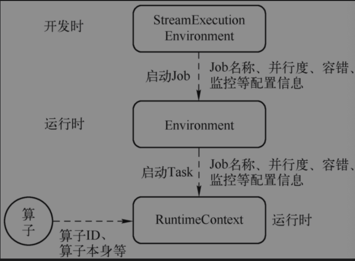

### RuntimeEnvironment
Task开始执行时进行初始化，将Task运行相关的信息封装进去，包含配置信息，运行时各种服务
```text
// Task.java
doRun(){
Environment env = new RuntimeEnvironment(jobId, vertexId, executionId, executionConfig, taskInfo, jobConfiguration, taskConfiguration, userCodeClassLoader, memoryManager, ioManager, broadcastVariableManager, taskStateManager, aggregateManager, accumulatorRegistry, kvStateRegistry, inputSplitProvider, distributedCacheEntries, partitionWriters, inputGates, taskEventDispatcher, checkpointResponder,operatorCoordinatorEventGateway, taskManagerConfig, metrics, this, externalResourceInfoProvider);
}
```
### RuntimeContext
Task实例运行时概念，每个Task实例都有自己RuntimeContext, 是Function运行时的上下文,可获取到作业级别信息，如并行度、task名称、执行配置信息（ExecutionConfig）、State, 可使用getRunctionContext()访问该对象

### StreamRecord
数据流中一条记录或者一个事件，也叫做数据记录，其中包含数据值本身和时间戳

### LatencyMarker
在Source中创建，在Sink节点来估计数据在整个DAG图中流转花费的时间，用来评估总体处理延迟。其中包含在数据源创造出来的时间戳、算子编号，以及数据源算子所在Task编号

### Watermark
是一个时间戳，用来告诉算子所有时间早于等于Watermark的时间事件或记录都已经到达，算子可根据Watermark触发窗口的计算、清理资源等。

### StreamStatus
通知Task是否会继续接收到上游记录或者Watermark，在Source算子中生成，会向下游传播。有两种状态：1. 空闲状态(IDLE) 2. 活动状态(ACTIVE)

### Transformation
表示创建数据流操作，每一个数据流都有一个底层操作，描述数据流的起源。如DataStream#map会创建一个Tranformation树，到程序执行时，会转换成SteamGraph使用。
>  包括两大类： 物理Transformation和虚拟Transformation，DataStream API都会转成Transformation，Transformation再转换成实际算子，虚拟的则不会转换具体算子，如 ReBalance、Union、Split等不会形成实体算子。

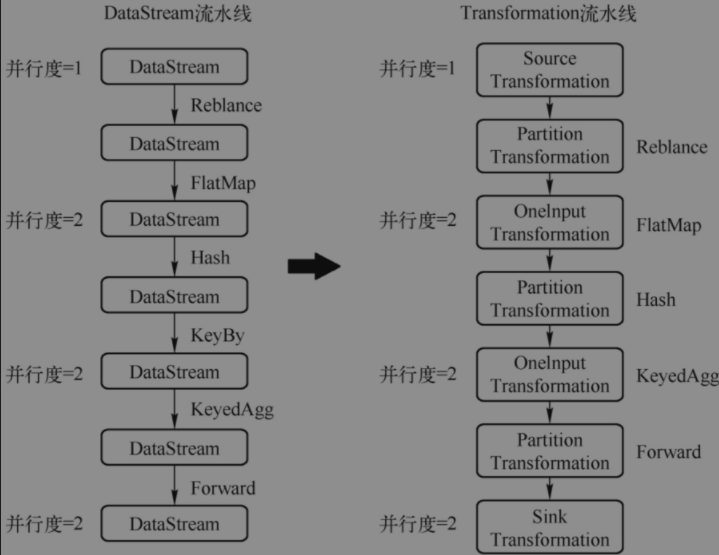
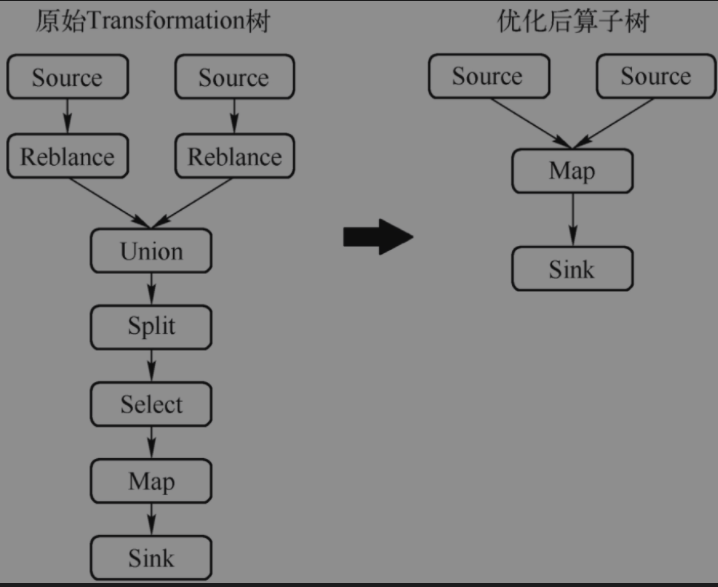

Transformation包含：
1. name:转换器名称，用于可视化 
2. uid: 用户指定,目的在job重启时再次分配之前相同uid,用于持久保存状态
3. bufferTimeout: buffer超时时间
4. parallelism: 并行度
5. id: 与uid无关,生成方式是基于一个静态累加器
6. outputType: 输出类型，用来进行序列化数据
7. slotSharingGroup: 给当前的Transformation设置Slot共享组

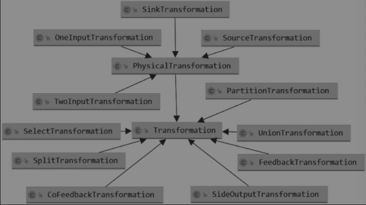
#### 物理Transformation

##### 1.SourceTransformation
> 从数据源读取数据的Transformation,flink作业的起点。只有下游Transformation,没有上游输入Transformation，一个作业可以有多个SourceTransformation，如多流Join、维表Join、BroadcastState场景
##### 2. SinkTransformation
> 数据写入外部存储的Transformation,flink作业的终点，只有上游Transformation,下游是外部存储，一个作业可以有多个SinkTransformation。
##### 3. OneInputTransformation
> 单输入的Transformation,只接收一个输入流,需要input(Transformation<IN>)和operator(OneInputStreamOperator<IN, OUT>)参数
##### 4. TwoInputTransformation
> 接收两种流作为输入，其他与3一样

#### 虚拟Transformation

##### 1.SideOutputTransformation
> 在旁路输出转换，上游Transformation的一个分流，可以有多个下游，每一个SideOutput通过OutputTag进行标识
##### 2. PartitionTransformation
> 用于改变输入元素分区,还需要提供一个StreamPartitioner实例进行分区，可统一表示批流数据Shuffle模式
##### 3. UnionTransformation
> 合并转换器，可将多个输入StreamTransformation进行合并,称为Union
##### 4. FeedbackTransformation
> flink Dag中反馈点,就是将符合条件的数据重新发回上游处理，可以连接一个或多个上游
##### 5. CoFeedbackTransformation
> 与4区别上游必须是TwoInputTransformation

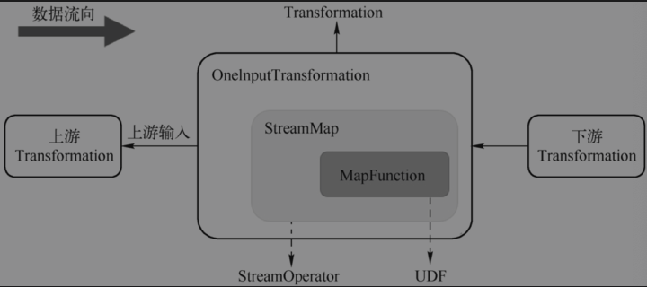

Transformation负责将初始化作业所需要的StreamTask和算子工程(StreamOperatorFactory)构建好，算子作为UDF的执行容器、将作业开发和作业运行联系起来

OneInputTransformation包装了算子StreamMap,算子包装了UDF。逻辑上连接了上下游Transformation
```java
// OneInputTransformation.java
public OneInputTransformation(Transformation<IN> input,String name,OneInputStreamOperator<IN, OUT> operator,TypeInformation<OUT> outputType,int parallelism) {
      this(input, name, SimpleOperatorFactory.of(operator), outputType, parallelism);
}
```
```java
// StreamMap.java
public StreamMap(MapFunction<IN, OUT> mapper) {
      super(mapper);
      chainingStrategy = ChainingStrategy.ALWAYS;
}
```
>OneInputTransformation -> StreamOperator(AbstractStreamOperator(AbstractUDFStreamOperator、OneInputStreamOperator(StreamMap))) -> MapFunction
### 算子
算子在Flink称为StreamOperator,由Task组成一个Dataflow,算子包含一个或多个算子，包装Function来执行。StreamTask算子容器，负责管理算子生命周期

#### 生命周期管理
1. setup: 初始化环境、时间服务、注册监控
2. open: 由具体算子负责实现，包含初始化逻辑，如状态初始化
3. close: 所有数据处理完毕之后关闭
4. dispose: 最后阶段执行，停止处理数据，资源释放

#### 状态与容错管理
当触发检查点的时候，保存状态快照，并且将快照异步保存到外部分布式存储，当作业失败时候算子负责从保存快照中恢复状态

#### 数据处理
1. OneInputStreamOperator
2. TwoInputStrEamOperator

> 单流输入算子,只接收上游1个数据流作为输入，StreamFilter、StreamMap、StreamSink、ProcessOperator
> 
> 双流输入算子,如CoGroup、Join操作，CoStreamMap、KeyedCoProcessOperator
> 
> 数据源算子，StreamSource
> 
> Join算子，HashJoinOperator、SortMergeJoinOperator
> 
> Sort算子，StreamSortOperator
> 
> Window算子，WindowOperator、ProcessOperator
> 
> 代码生成神算子，GeneratedOperator
> 
> 异步算子，AsyncWaitOperator(1,顺序输出模式 2.无序输出模式（组内无序，组间顺序）)

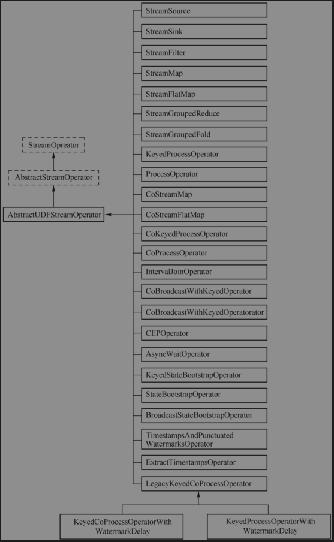
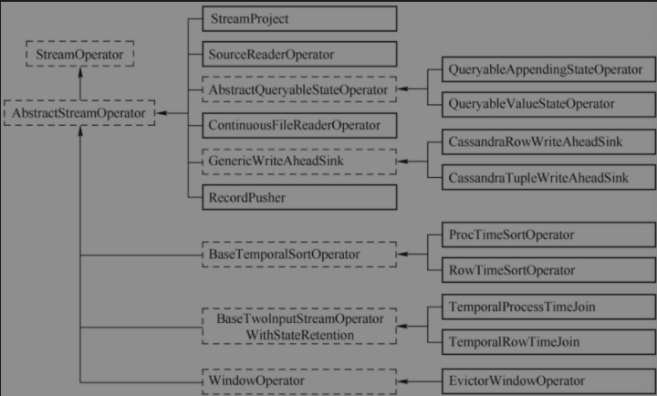

### 函数Function(UDF)
> Source Function -> Trans Function -> Sink Function
> 
#### 按函数层次从低到高：
> ProcessFunction: UDF接口 + 状态 + 生命周期 + 触发器 。如JoinFunction
> 
> RichFunction: UDF接口 + 状态 + 生命周期。如RichMapFunction
> 
> 无状态Function: UDF接口。如MapFunction

#### 处理函数(ProcessFunction)
> RichFunction -> AbstractRichFunction -> (ProcessFunction、ProcessWindowFunction、KeyedProcessFunction、RichFilterFunction等)

>基本构建块包含 1.事件(数据流元素)  2.状态(容错和一致性) 3.定时器(事件时间和处理时间)

1. 双流Join(CoProcessFunction)
```
即时双流Join: 
1.创建一个State对象 
2.接收输入流1事件后更新State 
3.接收到输入流2事件后遍历State,根据Join条件进行匹配，匹配后发送到下游
```
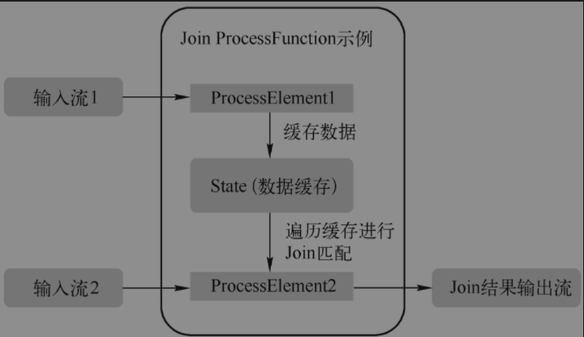

```text
双流延迟Join:
1.创建2个State对象，分别缓存两个输入流
2.创建一个定时器，等待数据到达，定时延迟触发Join计算
3.接收输入流1更新State
4.接收输入流2更新State
5.定时器遍历两个State,根据Join条件进行匹配，匹配后发送下游
```
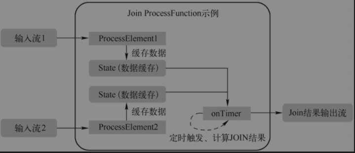

```text
延迟计算,与上边不同的关键是Watermark和Window,使用Window暂存数据,使用Watermark触发Window的计算
```
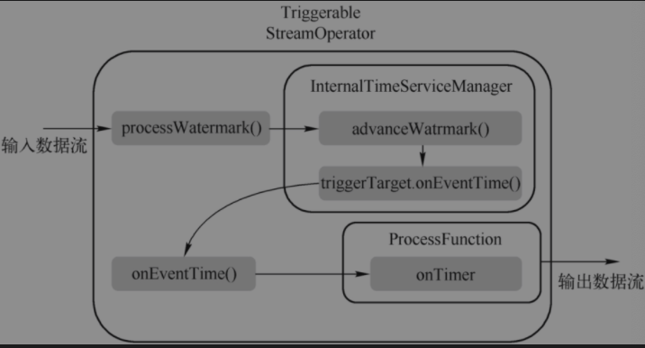

#### 数据源函数(SourceFunction)
1. 生命周期管理：AbstractRichFunction 包含open、close、cancel,包含初始化、清理等
2. 读取数据：持续从外部存储读取数据
3. 向下游发送数据
4. 发送Watermark：生成watermark并向下游发送
5. 空闲标记：当读取不到数据，则Task标记为空闲，向下游发送Status#idle,阻止Watermark向下游传递

#### 检查点函数(CheckpointedFunction)
1. initializeState:负责初始化State,执行从上一个检查点恢复状态
2. snapshotStat: 用于备份保存状态到外部存储

### 数据分区(Partition)
分布式计算就是把作业分成子任务Task,将不同数据交给不同Task计算，Partition就是把数据集切分成块，每一块数据存储在不同的机器上。StreamPartition抽象接口

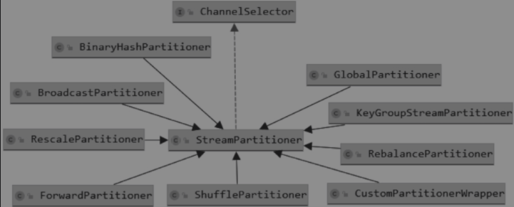
1. 自定义分区(CustomPartitionerWrapper)：用户自定义分区函数，为每个元素选择目标分区
2. ForwardPartitioner：用于同一个OperatorChain中上下游算子之间的数据转发，实际数据是直接传递到下游
3. ShufflePartitioner: 随机将元素进行分区，下游Task能均匀获取数据
4. ReblancePartitioner: 以ROUND-ROBIN方式为每个元素分配分区，下游Task均匀获得数据，避免数据倾斜
5. RescalingPartitioner: 根据下游Task数量进行分区，使用ROUND-ROBIN选择下游，如上游有2个Source，下游有6个Map,每个Source会分配3个固定到下游Map,不会向未分配分区写数据。
6. BroadcastPartitioner：将记录广播给所有分区，即有N个分区，就把数据复制N份
7. KeyGroupStreamPartitioner:应用KeyedStream,根据KeyGroup索引编号进行分区。

### 分布式ID(AbstractID)
应用Flink作业、资源管理、作业管理器、资源管理器、TaskManger等各自的身份标识。
