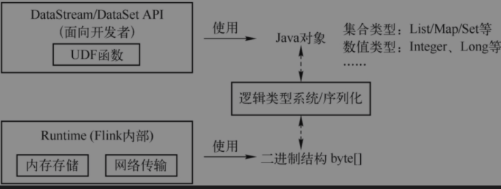
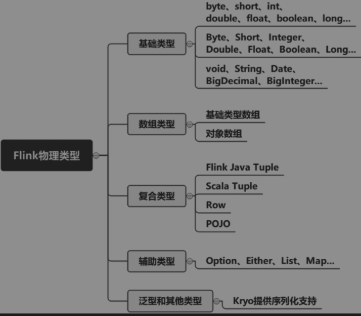
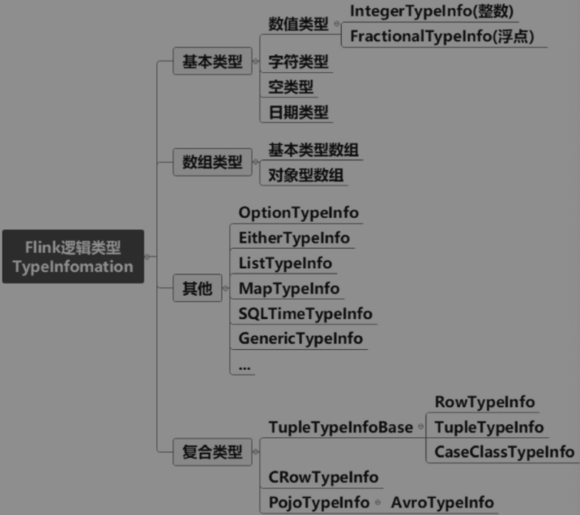
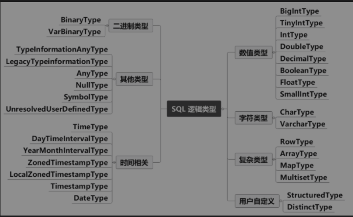
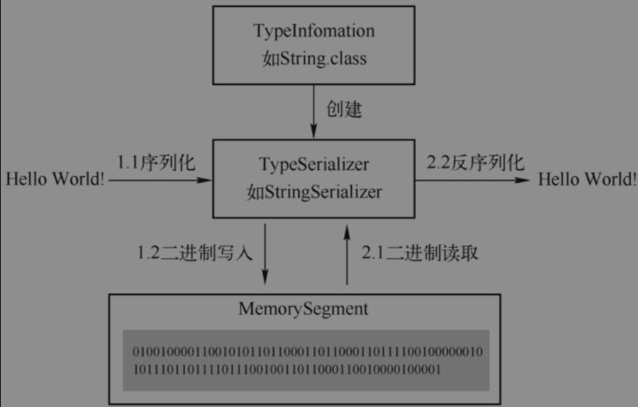
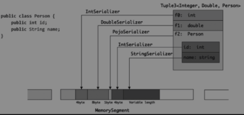

## 类型与序列化
Flink自主进行内存管理，将数据以二进制结构保存在内存，使用大量堆外内存。允许使用JDK提供类型和自定义类型开发Function,类型与序列化系统目的就是解决Java对象类型与内部二进制结构不一致问题。

> Flink目前有两套逻辑类型系统，1.TypeInformation类型 2.Flink SQL中的LogicalType类型系统
### DataStream类型系统
#### 物理类型

#### 逻辑类型
TypeInformation是所有逻辑类型的基类，是Java/Scala对象类型和Flink的二进制数据之间的桥梁，其中定义关键的序列化的方法createSerializer(ExecutionConfig config)，所有的逻辑类型必须实现该方法，在作业执行时，序列化器将Java/Scala对象序列化成二进制数据，从二进制数据中心反序列化为Java/Scala对象。

当自动类型推断，Java泛型机制是在编译级别实现的，编译器生成的字节码在运行期间并不包含泛型的类型信息。此时需要为Flink的应用提供类型信息，使用TypeHint的匿名类来获取泛型的类型信息
> TypeInformation.of(new TypeHint<Tuple2<String, Integer>>() {}))

### SQL类型系统

### 数据序列化

